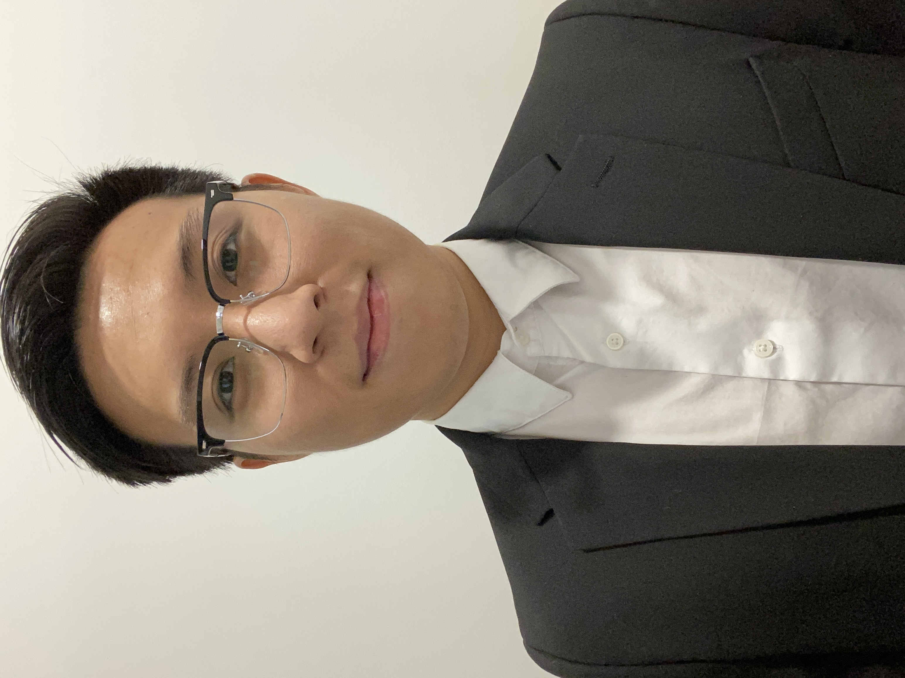
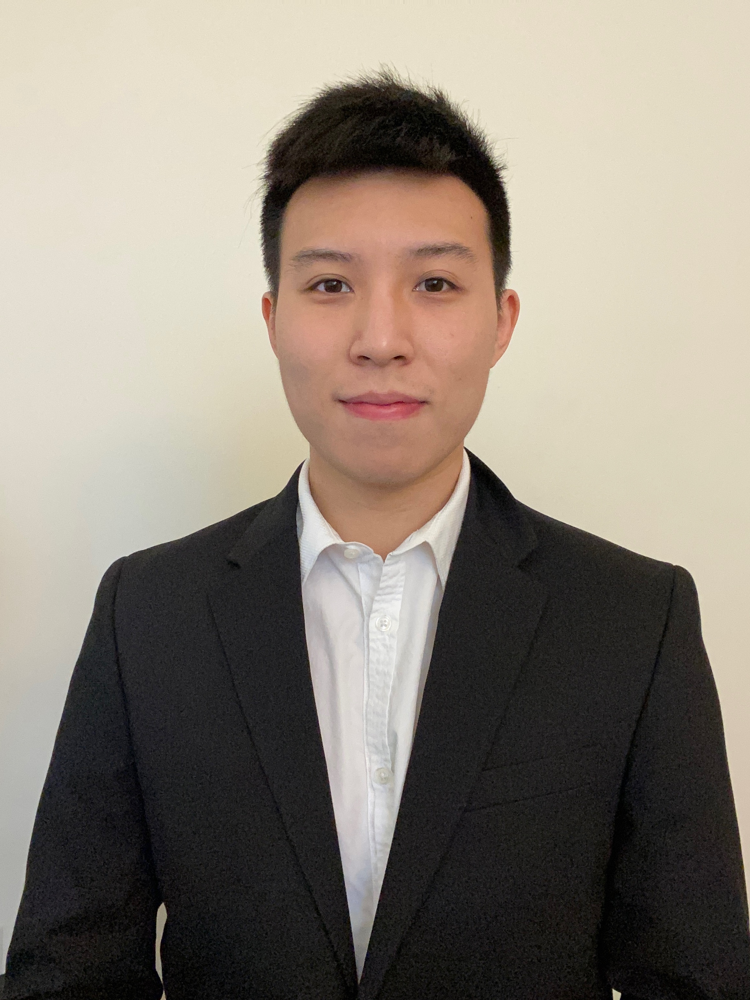

<!--   -->

I am a Master's student in the [Autonomous System Lab](https://uwaterloo.ca/autonomous-systems-lab/) at the University of Waterloo, advised by [Prof. Stephen L. Smith](https://uwaterloo.ca/autonomous-systems-lab/profiles/stephen-smith). I graduated with a B.S. in Computer Science with The Highest Honors from the University of Illinois at Urbana-Champaign (UIUC) in 2022. During my undergraduate study, I had the privilege of working with [Prof. Katherine Driggs-Campbell](https://krdc.web.illinois.edu/) in hierarchical human intention tracking for human-robot collaborations. After graduating from UIUC, I was honored to work with [Prof. Kris Hauser](https://kkhauser.web.illinois.edu/) as a post-baccalaureate research assistant on obstacle avoidance assistance for mobile robot teleoperation. 

My research interests are in robotics and robot learning, particularly in the context of planning, control, and human-robot interactions. 

## News
* [Recent] I will begin my **Ph.D. in Robotics** at the Georgia Institute of Technology in Fall 2025! 🐝 Go Buzz!!
* [Mar 2025] Our recent work "[Bench-NPIN: Benchmarking Non-prehensile Interactive Navigation](https://arxiv.org/pdf/2409.11326v1)" is currently under review for IROS 2025. Check out the [preprint](https://arxiv.org/pdf/2409.11326v1)!
* [Sept 2024] Our work "[Autonomous Navigation in Ice-Covered Waters with Learned Predictions on Ship-Ice Interactions](https://arxiv.org/pdf/2409.11326v1)" has been accepted by ICRA 2025 for publication!
* [Dec 2023] Our paper "[Attentiveness Map Estimation for Haptic Teleoperation of Mobile Robot Obstacle Avoidance and Approach](https://ieeexplore.ieee.org/abstract/document/10400830)" has been accepted by IEEE RA-L for publication!
